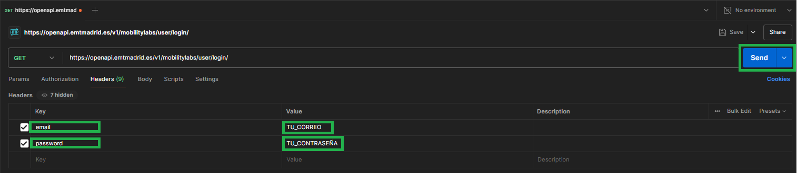
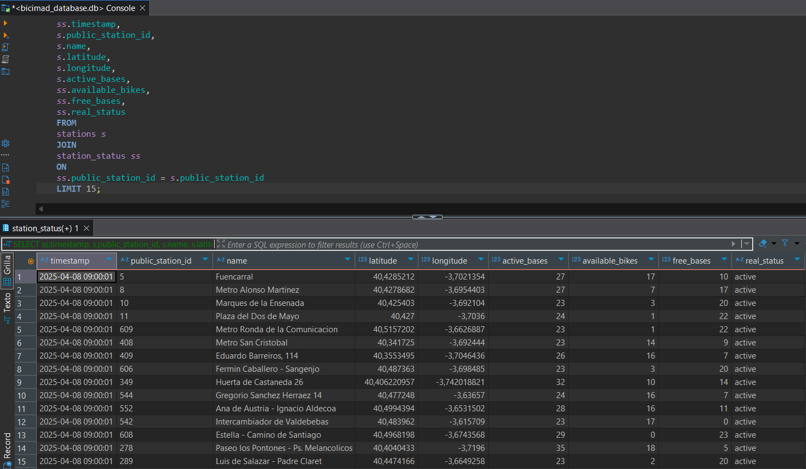
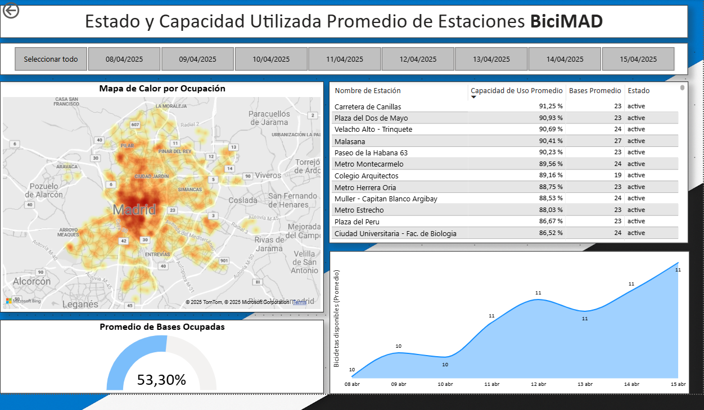
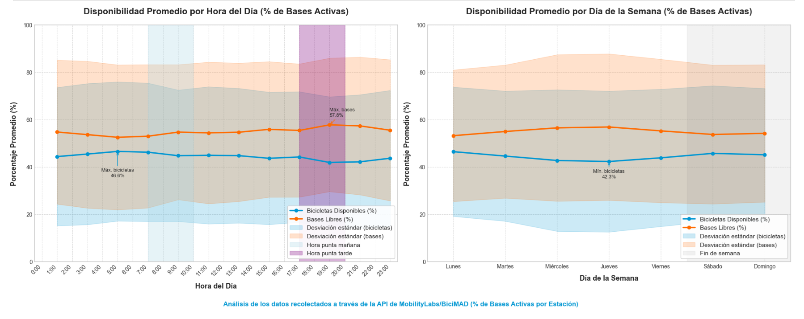

# Análisis de datos de BICIMAD

Este proyecto se encarga de la recolección, transformación y presentación de los dato las estaciones de Bicicletas de Madrid (BiciMAD).

## Propósito del proyecto
Este proyecto analiza el sistema de bicicletas compartidas BiciMAD de Madrid, mediante la recolección, transformación y visualización de datos en tiempo real. El objetivo es proporcionar insights sobre patrones de uso, demanda por estaciones y distribución geográfica del servicio para optimizar la gestión de recursos.

Con éste proyecto quiero demostrar y fortalecer mis habilidades como analista de datos mediante la recolección, transformación y visualización de datos de las estaciones BiciMAD en Madrid. A través de este análisis, busco responder preguntas clave sobre el uso del sistema, como:

* ¿Cómo varía la disponibilidad de bicicletas y bases a lo largo del día y la semana?
* ¿Cuáles son las estaciones con mayor y menor demanda?
* ¿Existe una relación entre el tamaño de una estación (su capacidad total de bases) y la demanda o el uso que experimenta?
* ¿Cómo se distribuye geográficamente el uso de BiciMAD y cuáles son las estaciones mas usadas?

Este proyecto servirá como un portafolio práctico que destaca mi capacidad para trabajar con APIs, gestionar grandes volúmenes de datos y presentar información de manera clara y efectiva utilizando herramientas como Python (pandas, matplotlib, seaborn) y Power BI.

## Hallazgos Clave

- Se identificaron patrones temporales claros en la disponibilidad de bicicletas, con una ocupación promedio del sistema del 53.30%

- Existen diferencias significativas en la demanda entre estaciones, destacando "Carretera de Canillas" con 91.25% de bicicletas extraidas.

- El sistema mantiene una alta disponibilidad operativa (99.36% de estaciones activas) pese a las estaciones inactivas y cerradas en puntos importantes de la ciudad.

- Se observa un incremento en estaciones no operativas al 2.87% desde el 11 de abril

## Metodología

El análisis se basa en datos recolectados mediante la API de Mobility Labs (EMT Madrid), procesados con Python y visualizados a través de un dashboard interactivo en Power BI que permite monitorear el estado operativo del sistema en tiempo real.

## Requisitos previos

- Python 3.8 o superior (Versión 3.12.5 usada para éste proyecto)

- Bibliotecas Python: pandas, numpy, requests, matplotlib, seaborn, folium (ver requirements.txt)

- Clave API de MobilityLabs EMT - Madrid (ver Instrucciones abajo)

- DBeaver 25.0.3

- Power BI Desktop Versión: 2.140.1577.0 64-bit (febrero de 2025) (opcional, para visualizar el dashboard)

## Estructura de archivos:

```
analisis-datos-bicimad/
├── data/
│   ├── raw/                                    # Datos CSV originales
│   │  └──bicimad_data            
│   ├── processed/                              # Datos CSV procesados (intermedios)
│   │  └──csv                     
│   ├── cleaned/                                # Datos CSV limpios (listos para la BD)
│   │  └──bicimad_stations_status.csv           # Datos para crear nuestra BD Dinamica
│   │  └──bicimad_stations.csv                  # Datos para crear nuestra BD estática
│   │  └──bicimad_full.csv                      # Datos para hacer nuestro Análisis Exploratorio en Notebook. 
│   └── eda/                                    # Datos para el Análisis Exploratorio
│       └── bicimad_data_cleaned_from_db.csv    # Datos extraidos de la base de datos para crear los dashboard en Power BI
├── images/
├── src/
│   ├── analysis/                               # Notebooks o scripts de análisis (EDA)
│   │   └── EDA_BiciMAD.ipynb
│   │   └── EDA_BiciMAD.html                    # Version HTML para mejor observación
│   ├── collector/
│   │   └── BiciMAD_Data_Collector.py           # Script para recolectar datos de la API
│   │   └──BiciMAD_Scheduled_Collector.py       # Script para programar la recolección de principio a fin
│   ├── data_processing/          
│   │   └──limpieza_datos_bicimad.ipynb         # Notebook con los scripts para la limpieza de los datos
│   │   └── create_db.py                        # Script para crear la base de datos
│   └── visualization/                          # Scripts para generar gráficos
│     └──presentacion_bicimad.pbix              # Dashboard de los datos procesados 
├── .env_example
├── .gitignore
├── database_queries.md           # Consultas SQL
└── README.md
```

# Trayecto del proyecto

### 1\. Registro en Mobility Labs

El primer paso es registrarse en la plataforma Mobility Labs de la EMT (Empresa Municipal de Transportes) de Madrid, que proporciona acceso a datos abiertos a través de su API: [Mobility Labs - Madrid](https://mobilitylabs.emtmadrid.es/desa/).

### 2\. Obtención del Access Token

Para acceder a los datos de la API, se requiere un `accessToken`. Este token puede obtenerse directamente desde la documentación de la API o utilizando Postman.

#### Obtención del Access Token con Postman:

1.  **Uso:** Puedes usar la herramienta a través de la página web o descargar su aplicación para escritorio: [www.postman.com](https://www.postman.com/).
2. **Registro:** Debes registrarte en la página oficial de postman para poder hacer uso de sus herramientas.
3.  **Crear una nueva solicitud:** Abre Postman y crea una nueva solicitud `POST`.
4.  **Configurar la URL:** Ingresa la URL de la API de login: `https://openapi.emtmadrid.es/v1/mobilitylabs/user/login/`.
5.  **Configurar los headers:** En la pestaña "Headers", añade dos pares clave-valor:
    * `email`: Tu correo electrónico registrado en Mobility Labs.
    * `password`: Tu contraseña registrada en Mobility Labs.
6.  **Enviar la solicitud:** Haz clic en "Send".
7.  **Obtener el Access Token:** En la respuesta JSON, busca el valor de la clave `accessToken`. Este es el token que necesitarás para acceder a los datos de BiciMAD.



El archivo JSON con el Access Token debe parecerse a este:

```json
{
    "code": "00",
    "description": "Register user: Tu_Usuario with token: API_KEY  Data recovered OK",
    "datetime": "2025-04-07T09:26:08.352892",
    "data": [
        {
            "updatedAt": "2025-02-15T09:29:28.8970000",
            "username": "Tu_usuario",
            "accessToken": "API_KEY",
            "email": "tucorreo@mail.com",
            "idUser": "ID_USER",
            "tokenSecExpiration": 86399,
            "apiCounter": {
                "current": 0,
                "dailyUse": 20000,
                "owner": 0,
                "licenceUse": "Please mention EMT Madrid MobilityLabs as data source. Thank you and enjoy!",
                "aboutUses": "If you need to extend the daily use of this API, please, register your App in Mobilitylabs and use your own X-ClientId and  passKey instead of generic login (more info in [https://mobilitylabs.emtmadrid.es/doc/new-app](https://mobilitylabs.emtmadrid.es/doc/new-app) and [https://apidocs.emtmadrid.es/#api-Block_1_User_identity-login](https://apidocs.emtmadrid.es/#api-Block_1_User_identity-login))"
            },
            "nameApp": "OPENAPI MobilityLabs"
        }
    ]
}
```

**Nota importante:** Mantén tu accessToken seguro y no lo compartas públicamente.

### 3\.Exploración de la API de Mobility Labs - EMT
La documentación de la [API Block 4 TRANSPORT BICIMAD](https://apidocs.emtmadrid.es/#api-Block_4_TRANSPORT_BICIMAD) detalla los diferentes endpoints disponibles. Para este proyecto, utilizaremos principalmente el endpoint [List BiciMAD Stations](https://apidocs.emtmadrid.es/#api-Block_4_TRANSPORT_BICIMAD-List_of_Bicimad_Stations) para recolectar información en tiempo real sobre la disponibilidad y el estado de las estaciones.

# Recolector de Datos BiciMAD

Este script consiste en un recolector automatizado para obtener y almacenar datos del sistema de bicicletas compartidas BiciMAD de Madrid. El recolector obtiene información de estaciones, disponibilidad y estado, almacenándola en formato CSV para su posterior análisis.

### Configuración

Crea un archivo .env en el directorio raíz con la siguiente estructura:

```
BICIMAD_ACCESS_TOKEN=tu_token_aqui
COLLECTION_INTERVAL_MINUTES=120
```

Instala las dependencias:

*bash*
```

pip install requests pandas python-dotenv schedule
```


### Uso básico

Para ejecutar el recolector continuamente:

*bash*

```
python BiciMAD_Data_Collector.py
```

Para ejecutar el recolector en un rango de tiempo específico:

*bash*

```
python BiciMAD_Scheduled_Collector.py
````

***Para modificar la fecha y hora de ejecucíón del script de recolección programada:***

```
# Definir tiempos de inicio y fin
# Para la hora de inicio, usar la fecha actual y establecer la hora a las 13:05
now = datetime.datetime.now()

# Si la hora actual es después de las 13:05, usar la hora actual como inicio
# Si no, usar las 13:05 de hoy como inicio
if now.hour > 13 or (now.hour == 13 and now.minute >= 5):
    start_time = now
else:
    start_time = now.replace(hour=13, minute=5, second=0, microsecond=0)

# La fecha de fin es el 14 de abril a las 13:05
end_time = datetime.datetime(2025, 4, 14, 13, 5, 0)
````

### Estructura de datos:

Los datos se guardan en formato CSV con las siguientes columnas:

| Campo | Descripción |
| - | - |
| timestamp | Fecha y hora de la recolección |
| station_id | Identificador único de la estación |
| name | Nombre de la estación |
| address | Dirección física |
| longitude | Coordenada de longitud |
| latitude | Coordenada de latitud |
| total_bases | Número total de anclajes |
| active_bases | Anclajes operativos |
| available_bikes | Bicicletas disponibles |
| free_bases | Anclajes libres |
| reservations | Reservas activas |
| status | Estado de la estación (1= Activo, 0= Inactivo) |

## Transformación y Limpieza de Datos

Durante la limpieza y verificación del dataset de BiciMAD, se abordaron los siguientes puntos clave:

* **Formato de Datos:** Se corrigieron los tipos de datos de `timestamp`, `latitude`, y `longitude`.
* **Extracción de ID:** Se separó el `public_station_id` del nombre de la estación en la columna `name`.
* **Datos Faltantes:** Se completaron las ausencias de datos (debido a cierres programados y otras razones) llenando con ceros y utilizando información existente.
* **Estado Real de las Estaciones:** Se creó una columna `real_status` (`active`, `inactive`, `closed_for_schedule`) para reflejar la operatividad real, considerando los cierres programados y la disponibilidad reportada.
* **Formato de Direcciones:** Se eliminó la coma final de la columna `address`.
* **Valores Cero:** Se analizó la coherencia de los valores cero en relación con el estado operativo de las estaciones.
* Eliminación de la columna `reservations` por no brindar ninguna información util o actualizada.

**Inconsistencias en la Capacidad de las Estaciones:**

Durante la exploración de los datos, se identificaron inconsistencias significativas relacionadas con la capacidad de las estaciones:

* **Discrepancia con Fuentes Externas:** El número de puertos de anclaje reportado en la columna `total_bases` no siempre coincidió con la información visual del mapa oficial de BiciMAD ni con la suma de los valores de las columnas `free_bases` y `available_bikes` sugiriendo posibles desactualizaciones en la API.
* **Consistencia Interna:** A pesar de las inconsistencias con `total_bases`, se encontró una consistencia interna donde `available_bikes` + `free_bases` = `active_bases`, sugiriendo que `active_bases` podría ser un indicador más fiable del número de bases operativas en un momento dado.

**Estrategia de Tratamiento de la Capacidad:**

* Se mantienen las columnas de total_bases para una estimación nominal y se usará active_bases para las exploraciones y analisis, ya que estima la capacidad real de cada estación.

# Análisis Exploratorio de Datos de BiciMAD (Solo Estaciones Activas)

Durante el Ánalisis Exploratorio de los Datos hemos podido responder las preguntas que nos planteamos al principio de éste documento de las cuales hemos podido sacar las siguientes conclusiones:

- **Patrones de Disponibilidad Temporal:** El análisis de la disponibilidad de bicicletas y bases a lo largo del tiempo revela patrones diarios y posiblemente semanales en el uso del sistema. Identificar las horas pico y los períodos de menor actividad puede ser crucial para la gestión de la flota y la planificación de la redistribución.

- **Demanda de Estaciones:** Existen diferencias significativas en la demanda entre las estaciones. Algunas estaciones consistentemente experimentan una alta rotación de bicicletas (alta demanda), mientras que otras tienen un uso comparativamente menor. Esta información es vital para optimizar la ubicación de las estaciones y la asignación de recursos.

- **Distribución General de Bicicletas y Bases:** La distribución general de bicicletas disponibles y bases libres en el sistema muestra tendencias sobre la ocupación típica de las estaciones. Comprender estas distribuciones puede ayudar a evaluar la salud general del sistema y la capacidad de las estaciones para satisfacer la demanda.

- **Relación entre Capacidad y Uso:** La exploración de la relación entre la capacidad de las estaciones y su uso promedio diario puede indicar si las estaciones más grandes tienden a tener una mayor o menor demanda. Esta información puede ser útil para la planificación de la capacidad de nuevas estaciones o la expansión de las existentes.


## Análisis del Sistema BiciMAD: Dashboard Operativo

### Resumen Técnico

Este dashboard proporciona una visión integral del estado operativo del sistema de bicicletas compartidas BiciMAD en Madrid, ofreciendo métricas clave y visualizaciones interactivas para monitorizar el rendimiento de la red.

#### Componentes Principales

**Estado y Capacidad Utilizada**

- **Mapa de Calor por Ocupación:** Visualización geoespacial que muestra la densidad de uso de las estaciones en Madrid, identificando zonas con alta ocupación de las bases de anclaje.

- **Promedio de Bases Ocupadas:** Indicador global que muestra una ocupación de las bases de anclaje del 53,30% en el sistema.

- **Tabla de Estaciones:** Detalle de las estaciones con mayor capacidad de uso promedio, destacando "Carretera de Canillas" con el 91,25% de sus bicicletas en uso.

- **Gráfico Temporal:** Evolución del promedio de bicicletas disponibles por estación durante el período analizado (8-15 de abril de 2025).

#### Estaciones Inactivas

- **Porcentaje de Estaciones Activas:** 99,36% de disponibilidad del sistema.

- **Mapa de Estaciones No Operativas:** Visualización geográfica de las estaciones inactivas o cerradas por programación.

- **Tabla de Detalle:** Información sobre estaciones no operativas, incluyendo capacidad, estado y días de inactividad.

- **Gráfico Temporal:** Evolución del porcentaje de estaciones no operativas, mostrando un incremento estable al 2,87% desde el 11 de abril.

#### Actividad de las Estaciones

- **Promedio de Bases y Bicicletas:** Comparativa diaria entre bases libres y bicicletas disponibles por estación.

- **Tasa de Ocupación:** Indicador global de 83,81% de estaciones con 2 o menos bicicletas disponibles.

- **Análisis Horario:** Patrón de disponibilidad de bicicletas por hora, mostrando fluctuaciones que reflejan los patrones de uso diarios.

- **Serie Temporal:** Evolución comparativa entre bases libres y bicicletas disponibles, permitiendo identificar tendencias y patrones de demanda.

#### Características Técnicas

- Dashboard interactivo con filtros por fecha (8-15 de abril de 2025)

- Segmentación por estado operativo de las estaciones (active, closed_for_schedule, inactive)

- Visualizaciones geoespaciales integradas con datos operativos

- Métricas de rendimiento en tiempo real

- Análisis temporal para identificación de patrones y tendencias

## Hallazgos y Visualizaciones

- **Query (ejemplo) de los datos utilizados para el dashboard en power BI**

- **Imagen del primer dashboard de Estado y Capacidad utilizada en Power BI**

- **Imagen de parte del Análisis Exploratorio de los Datos (Disponibilidad Promedio de Bases libres y Bicicletas Disponibles por hora y semana)**


## Créditos y referencias

Este proyecto utiliza información elaborada por Mobility Labs - EMT Madrid a través de su plataforma abierta. Los datos están sujetos a los términos y condiciones establecidos por Mobility Labs - EMT Madrid, que pueden encontrarse en su sitio web oficial: [Terminos de Uso](https://mobilitylabs.emtmadrid.es/sip/terms-of-use)


Este repositorio de código se distribuye bajo la licencia MIT. Consulta el archivo LICENSE para más detalles.

## Contacto

Leonardo Leal Vivas

[ljlv81@gmail.com](mailto:ljlv81@gmail.com)

GitHub: [LeonardoLeal08](https://github.com/LeonardoLeal08?tab=repositories)