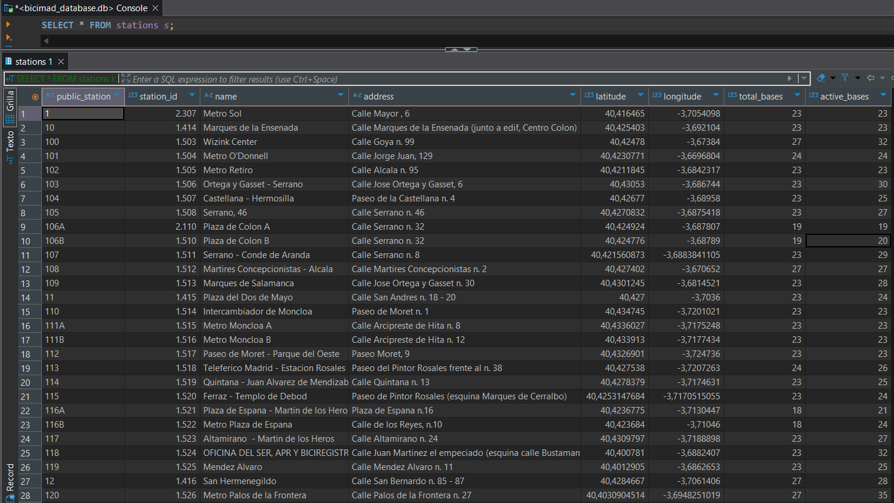
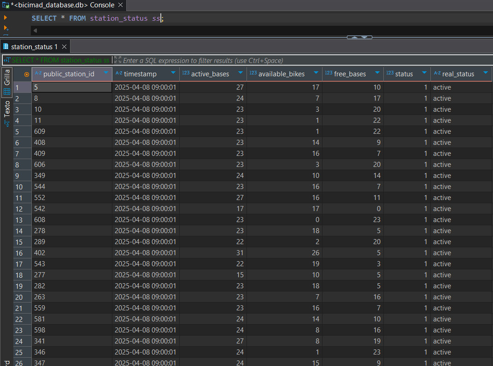
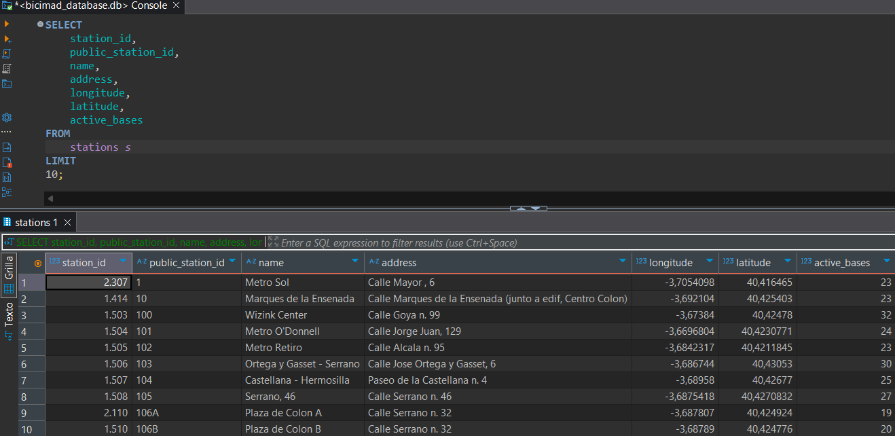
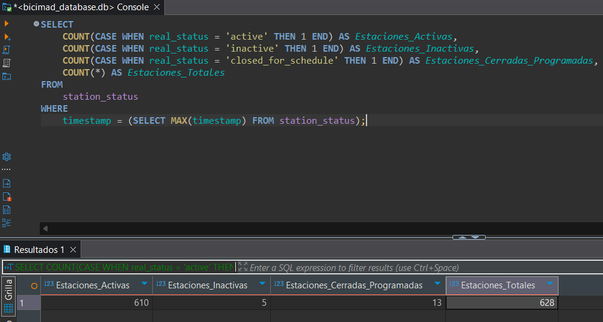
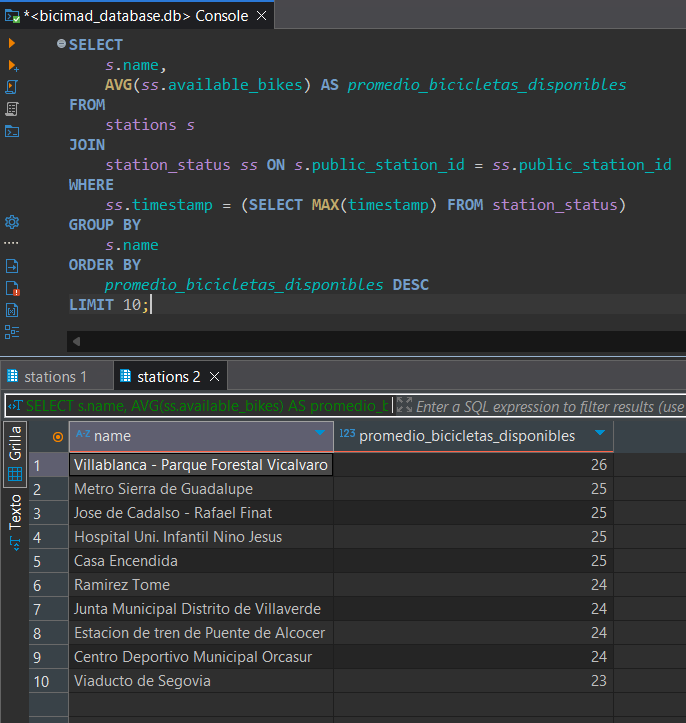
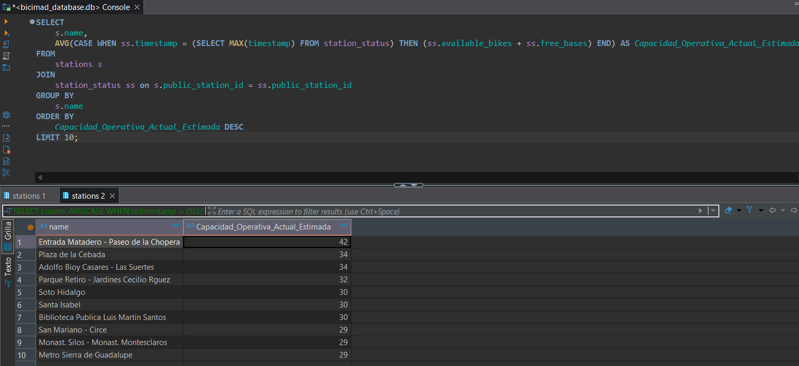
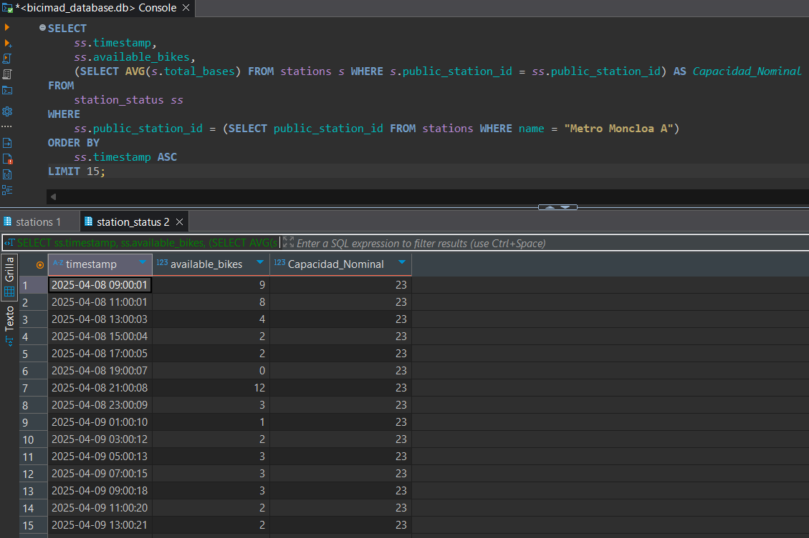
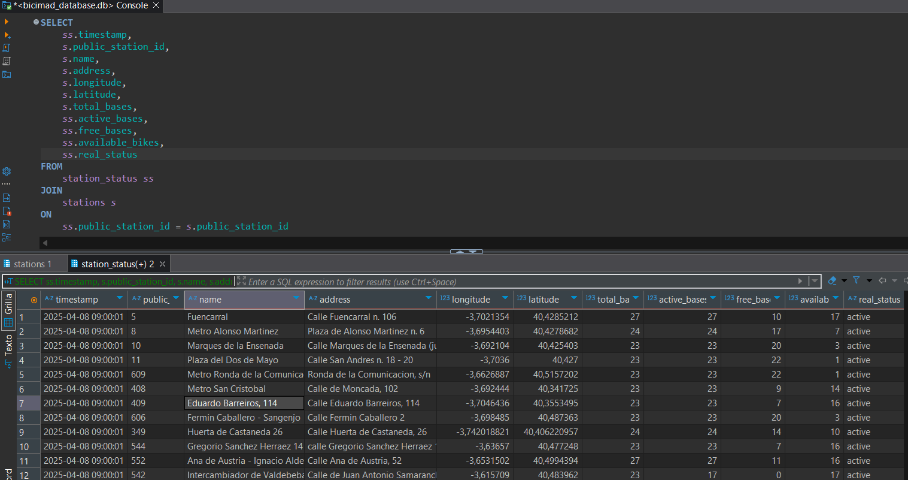

# Exploración de la Base de Datos SQLite de BiciMAD

En este documento, se detalla el proceso de interacción con la base de datos SQLite creada para almacenar y analizar los datos del sistema de bicicletas públicas de Madrid (BiciMAD). Tras la fase de limpieza y procesamiento de los datos, se utilizó SQLite para organizar la información en dos tablas principales: `stations` (información estática de las estaciones) y `station_status` (información dinámica del estado de las estaciones a lo largo del tiempo).

A continuación, se presenta el esquema de estas tablas, seguido de ejemplos de consultas SQL utilizadas para explorar los datos y obtener información relevante para el análisis del sistema BiciMAD.

### Esquema de la tabla stations

### Esquema de la tabla stations status

## Consultas realizadas

### Información general de las estaciones

Esta consulta básica muestra información general sobre las estaciones de BiciMAD, incluyendo su ID interno, ID público, nombre, dirección, ubicación geográfica (latitud y longitud) y el número total de bases de anclaje disponibles en cada estación. Los resultados están limitados a 10 para una mejor visualización.

### Estado operativo de las estaciones

Esta consulta analiza el estado operativo de todas las estaciones en la última lectura de tiempo registrada. Utiliza funciones de agregación condicional (COUNT con CASE WHEN) para determinar cuántas estaciones estaban activas, inactivas o cerradas por programación en ese momento específico. Esto proporciona una instantánea del estado general del sistema.

### Disponibilidad promedio de bicicletas por estación (Ultima recolección)

Esta consulta une las tablas stations y station_status para calcular el promedio de bicicletas disponibles para cada estación en la última lectura de tiempo. Luego, ordena los resultados de mayor a menor promedio y muestra las 10 estaciones con la mayor disponibilidad promedio de bicicletas en ese momento.

### Estaciones con mayor cantidad de bases de anclaje

Esta consulta estima la capacidad operativa actual de cada estación tomando la suma de bicicletas disponibles y bases libres en la última lectura registrada. Al ordenarlas de mayor a menor, muestra las estaciones que, según los datos más recientes, tienen la mayor capacidad para albergar bicicletas. Esto proporciona una perspectiva más dinámica y basada en el uso real que la columna estática total_bases.

## Tendencia de Bicicletas Disponibles para una Estación Específica (Metro Moncloa A)

Esta consulta muestra la tendencia de la cantidad de bicicletas disponibles para una estación específica a lo largo del tiempo. Primero, se obtiene el public_station_id de la estación por su nombre usando la siguiente consulta: `SELECT public_station_id FROM stations WHERE name = 'Metro Moncloa A';` y luego se seleccionan las marcas de tiempo y el número de bicicletas disponibles, ordenados cronológicamente. Los resultados están limitados a 15 para visualizar una tendencia reciente.

## Extracción de Datos Consolidados para Dashboard en Power BI

Esta consulta SQL combina datos de las tablas station_status y stations para generar un conjunto de datos consolidado, ideal para crear los Dashboards en Power BI. Selecciona la marca de tiempo del estado de la estación, el ID público y el nombre de la estación, junto con las métricas clave de disponibilidad (available_bikes), bases libres (free_bases), bases activas (active_bases) y bases totales (total_bases). Este conjunto de datos proporciona una visión integral del estado y la capacidad de las estaciones a lo largo del tiempo, facilitando la identificación de patrones, tendencias y posibles anomalías.